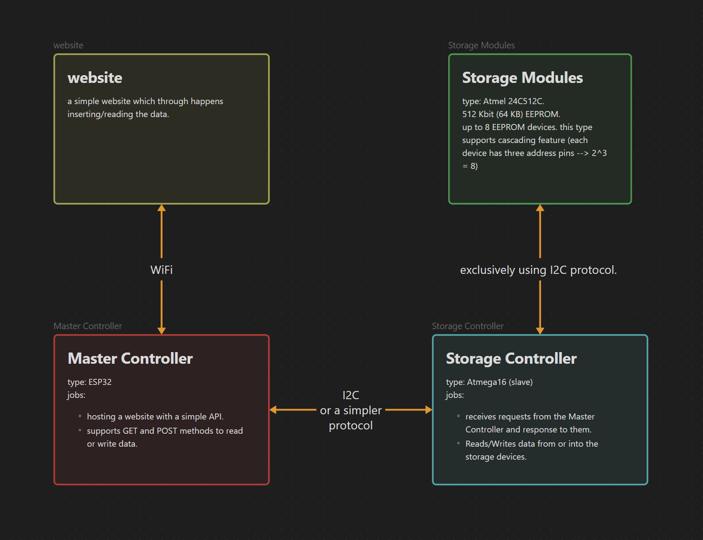

# NAS Prototype
Network Attached Storage (NAS) devices are known for how useful it is in Networking.
and here, with this simple project, we are making a small, simple prototype of a NAS device. the main idea is the same, a device that is attached to a network, can be accessed by users who have permissions in the network and store their files.

### Overview


## The Hardware:
- ESP32: provides a WiFi access point with a web server that serves as a Front end for the device.
- Atmega16: Storage controller, a bridge between the ESP32 and Memory Modules.
- EEPROM Chips: the Memory module.
### Hardware design


## The Software:
the code is divided to five critical modules:
- master module: the TWI Master mode implementation used between the Atmega16 MCU and the EEPROM chips, which exclusively uses the TWI module for R/W operations.

- SPI module: a small implementation for necessary communications between two devices using the SPI protocol.
    It is mainly used between the ESP32 and Atmega16 to talk to each other in the project.

- transfer module: handles the Commands and their corresponding action between the two MCUs (ESP32 and Atmega16).

- FS module: the Filesystem module is the core module of organizing the memory, including Byte/Block R/W operations.
    it handles the filesystem level actions, like formatting, reading FS table, creating entries for files with their metadata and a few more features.

- Storage module: designed for file-level R/W operations.
    it relies on the FS module in order to provide a simple and easy-to-use API for Reading or Writing a file based on some arguments.


this TWI implementation is used by another set of function which handles the R/W operations from and into the storage.

what these functions basically do is:
- read the inodes table (something like a filesystem table. format and create if it does not exist).
- read/write a file (bytes or pages, depends on size).
- update inodes table.\
this is it for now, but i am planning on fixing issues and adding more features.

#### inodes:
an inode is a simple data structure that holds metadata about a file.

I followed the UNIX and UNIX-Like (Linux) philosophy for this goal (nah, not even close actually, but i mean the idea).

> it worth it to mention that Linux based systems treats everything as a file.\
> Also, the name `inode` refers to `index node`, and it is the name of the data structure that serves the same purpose in Linux based systems.

the simple inode structure:

```C
struct inode                    // 28 Bytes
{
    uint16_t block_number;      // 2  Bytes
    uint16_t size;              // 2  Bytes
    int16_t next[7];            // 14 Bytes
    char name[10];              // 10 Bytes
};
```
an instance of this inode is going to be an entry inside the inodes table (FS table).


# The Filesystem:
I implemented a very simple filesystem to deal with the memory, here is the description:

the memory is devided into blocks, 128 byte each. the first 64KB are reserved for the filesystem.

detailed specefications:
- maximum files number is set to 64. this can be modified with the same code. but we fixed it due to Atmega16 limitations.
- maximum file size is 1KB. (for the same reasone above).
- a file occupies at least a block or more depending on it's size (8 Max).
- the storage can be extended up to 512 KB (8 memory modules, 64 KB each).


# Problems and Fixes:
everything works as expected when each MCU (ESP32 and Atmega16) tested separately. it seems like there's a problem with SPi implementation, it can be fixed easily by trying several times. the code seems fine and i didn't notice where the problem is.\
Because of my limited Hardware access and lack of debugging tools, also, i couldn't gether the two of the MCUs in one simulator, i gave up for now (Exam is near :( ). But, I am planning on several improvements, here's a few (considering everything works correctly):
- ability to delete files (it's a hard thing due to some replacing and searching algorithms)
- extending the storage.
- increase the maximum number of files that the filesystem can handle.
- increase the maximum file size.
- ability to execute some text files (something like scripts, using assembly-like syntax or so).\
and a lot more.